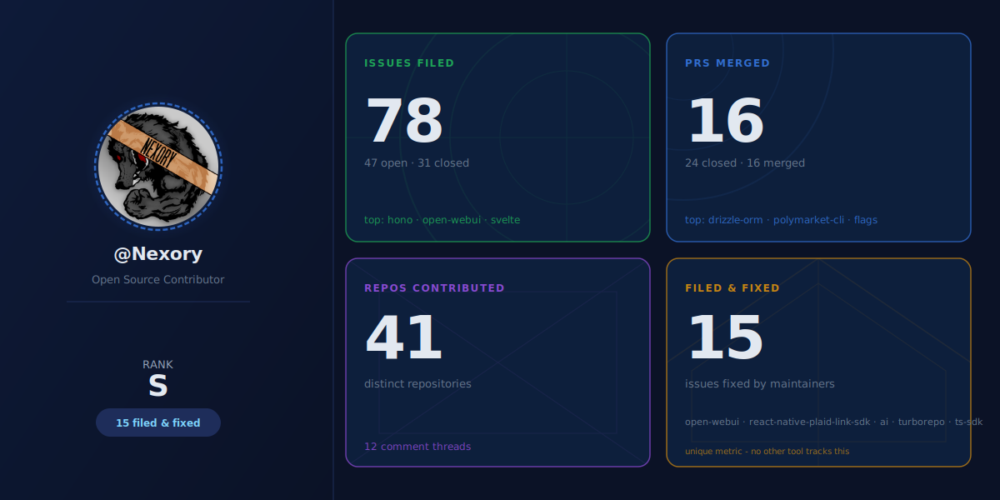
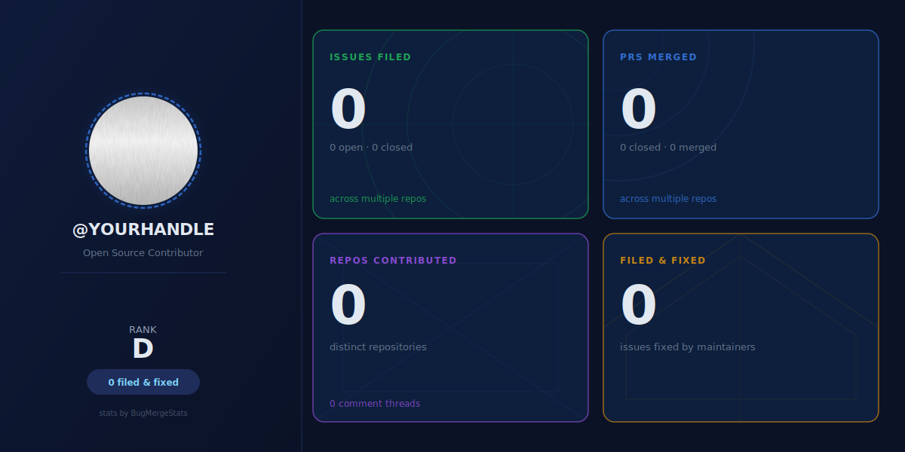

# gh-contrib-stats

A CLI tool and GitHub Action that generates a static SVG contribution card for any GitHub user, including the unique **filed-and-fixed** metric: issues you filed that were later fixed by a third-party maintainer PR.

No other tool tracks this lineage.



---

## Metrics shown

| Metric | What it counts |
|---|---|
| Issues Filed | All issues authored by you across all public repos |
| PRs Merged | Pull requests you authored that were merged |
| Repos Contributed | Distinct repos touched via issues or PRs |
| Comment Threads | Distinct issues/PRs where you left a comment |
| Filed & Fixed | Issues you filed where a **third-party** PR fixed it |
| Rank | Weighted grade: S / A / B / C / D |

---

## Quick start

```bash
npx gh-contrib-stats --user YOUR_HANDLE --output card.svg
```

With a token (recommended - raises rate limit from 60 to 5000 req/h):

```bash
GITHUB_TOKEN=ghp_xxx npx gh-contrib-stats --user YOUR_HANDLE --output card.svg
```

Embed in your GitHub profile README:

```markdown

```

---

## GitHub Action (auto-update)

Add this to `.github/workflows/update-card.yml` in your profile repo:

```yaml
name: Update contribution card
on:
  schedule:
    - cron: "0 3 * * *"
  workflow_dispatch:

jobs:
  update:
    runs-on: ubuntu-latest
    steps:
      - uses: actions/checkout@v4
      - uses: Nexory/gh-contrib-stats@v1
        with:
          github_token: ${{ secrets.GITHUB_TOKEN }}
          username: YOUR_HANDLE
          output_path: card.svg
```

---

## CLI flags

| Flag | Default | Description |
|---|---|---|
| `--user` | required | GitHub username |
| `--output` | required | Output SVG path |
| `--theme` | `dark` | `dark` or `light` |
| `--token` | `$GITHUB_TOKEN` | Personal access token |
| `--no-avatar` | false | Skip avatar fetch |
| `--cache-ttl` | `360` | Cache TTL in minutes |

---

## How filed-and-fixed works

The tool walks the GitHub issue timeline for each closed issue you filed. It looks for a `cross-referenced` event where:

1. The source is a **pull request** (not another issue).
2. That PR was **merged** (`merged_at` is non-null).
3. The PR author is **not you** (third-party fix, not self-close).

This is the only public tool that surfaces this metric.

---

## Rate limits

- Without token: 60 requests/hour (public API). Sufficient for users with fewer than 50 issues.
- With token: 5000 requests/hour. Sufficient for all users.
- Results are cached for 6 hours in `.gh-contrib-stats-cache.json`.

---

## License

MIT - Nexory 2026